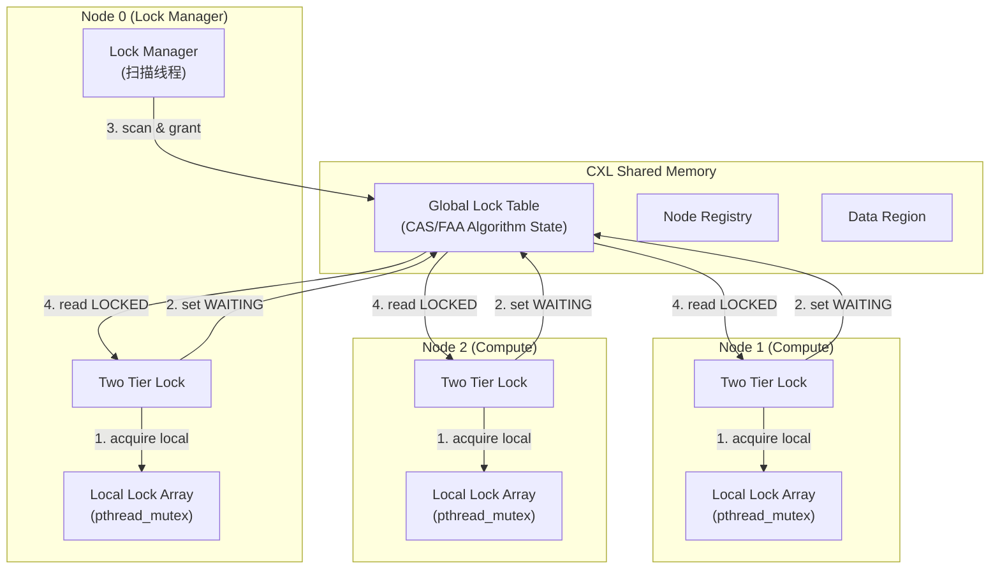
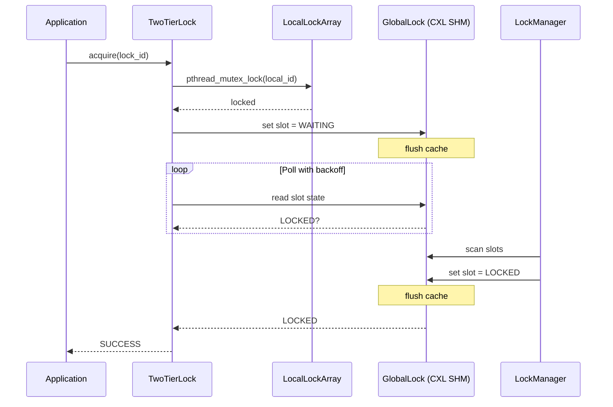
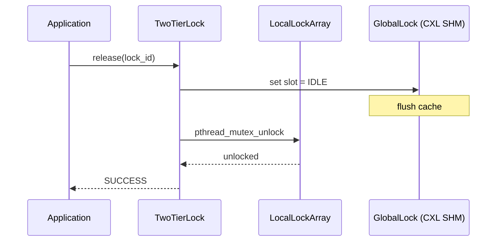
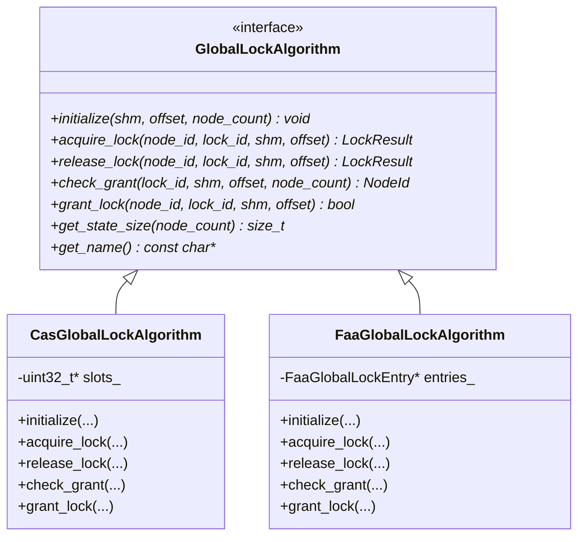
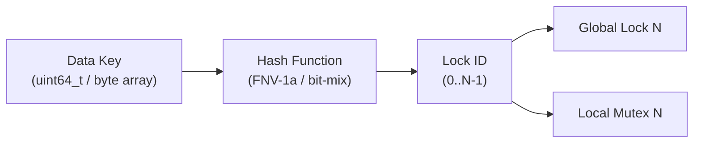
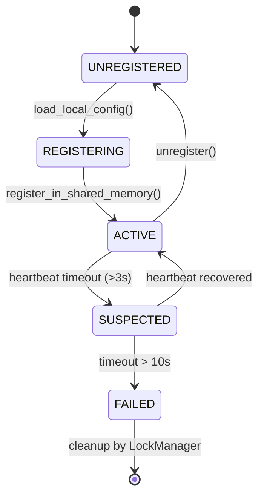
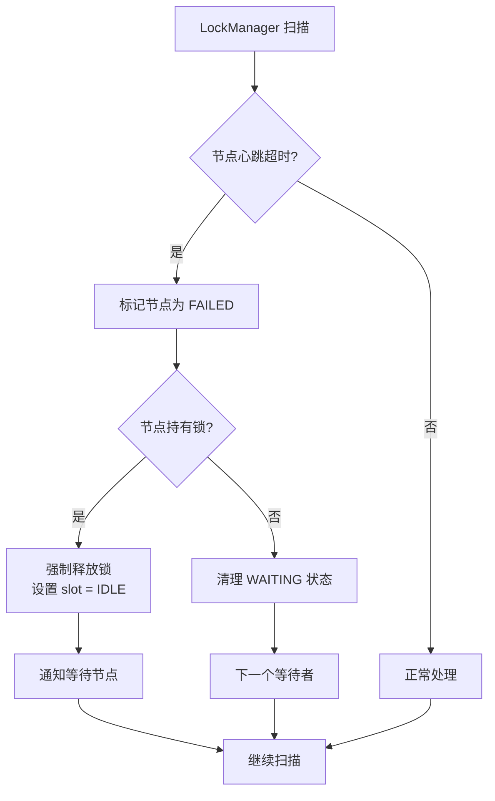

# CXL 分布式锁系统 - 架构文档

## 目录

1. [系统概述](#1-系统概述)
2. [系统架构图](#2-系统架构图)
3. [锁获取流程图](#3-锁获取流程图)
4. [锁释放流程图](#4-锁释放流程图)
5. [可插拔锁算法架构](#5-可插拔锁算法架构)
6. [数据到锁的映射](#6-数据到锁的映射)
7. [共享内存布局](#7-共享内存布局)
8. [缓存一致性管理](#8-缓存一致性管理)
9. [节点状态机](#9-节点状态机)
10. [容错与故障恢复](#10-容错与故障恢复)

---

## 1. 系统概述

CXL (Compute Express Link) 分布式锁系统是一个为 CXL 共享内存池设计的两层级分布式锁框架。该系统允许多个计算节点通过 CXL 互连技术访问共享内存，并以协调一致的方式获取和释放锁，确保数据一致性。

### 核心特性

| 特性 | 说明 |
|------|------|
| 两层锁架构 | 本地 DRAM 互斥锁 + 全局 CXL 共享内存锁状态 |
| 可插拔算法 | 支持 CAS (Compare-And-Swap) 和 FAA (Fetch-And-Add) 两种全局锁算法 |
| 零拷贝设计 | 锁状态直接存储于 CXL 共享内存，无 RPC 开销 |
| 缓存一致性 | 支持软件一致性 (CLFLUSH) 和硬件一致性两种模式 |
| 健康监控 | 内置节点心跳检测与故障发现机制 |
| 自适应退避 | 从自旋到睡眠的多级退避策略，减少总线争用 |

---

## 2. 系统架构图



### 架构说明

系统由多个计算节点和一个锁管理器组成，所有节点通过 CXL 总线访问共享内存池：

1. **本地锁层级 (Local Lock Tier)**：每个节点拥有独立的 `LocalLockArray`，使用 `pthread_mutex_t` 数组实现。本地锁保护线程级并发，是锁获取的第一道屏障。

2. **全局锁层级 (Global Lock Tier)**：锁状态存储在 CXL 共享内存中，所有节点均可直接读写。通过原子操作（CAS/FAA）协调跨节点的锁竞争。

3. **锁管理器 (Lock Manager)**：一个专用扫描线程定期遍历全局锁状态，将处于 WAITING 状态的节点授予 LOCKED 状态。

4. **共享内存区域 (Shared Memory Region)**：通过 `mmap()` 映射 DAX 设备（生产环境）或普通文件（测试环境），提供字节级寻址的共享存储。

---

## 3. 锁获取流程图



### 锁获取步骤详解

| 步骤 | 组件 | 操作 | 说明 |
|------|------|------|------|
| 1 | TwoTierLock | 计算 `local_id = lock_id % local_count` | 将全局锁映射到本地互斥锁 |
| 2 | LocalLockArray | 调用 `pthread_mutex_lock()` | 获取线程级锁，阻塞等待 |
| 3 | TwoTierLock | 通过算法设置全局状态为 WAITING | 声明对全局锁的竞争意图 |
| 4 | GlobalLock | 执行 CLFLUSH + MFENCE | 确保其他节点可见（软件一致性模式） |
| 5 | TwoTierLock | 轮询全局状态（自适应退避） | 自旋 -> PAUSE -> yield -> usleep |
| 6 | LockManager | 扫描所有锁槽位 | 查找 WAITING 状态的节点 |
| 7 | LockManager | CAS 设置 slot = LOCKED | 原子授予锁所有权 |
| 8 | TwoTierLock | 检测到 LOCKED 状态 | 锁获取成功，返回调用者 |

---

## 4. 锁释放流程图



### 锁释放步骤详解

| 步骤 | 组件 | 操作 | 说明 |
|------|------|------|------|
| 1 | TwoTierLock | 通过算法设置全局状态为 IDLE | 放弃对全局锁的所有权 |
| 2 | GlobalLock | 执行 CLFLUSH + MFENCE | 确保其他节点立即可见释放状态 |
| 3 | LocalLockArray | 调用 `pthread_mutex_unlock()` | 释放线程级锁，允许其他线程进入 |
| 4 | TwoTierLock | 返回成功 | 锁释放完成 |

> **注意**：锁释放的顺序是先释放全局锁，再释放本地锁。这样可以确保：
> 1. 全局锁的释放立即使得锁管理器可以将锁授予下一个等待节点
> 2. 本地锁的释放允许本节点的其他线程参与下一轮竞争

---

## 5. 可插拔锁算法架构



### 算法对比

| 特性 | CAS 算法 | FAA 算法 |
|------|----------|----------|
| **公平性** | 非公平（先到不一定先得） | 公平（FIFO 顺序授予） |
| **共享内存布局** | 二维数组 `slots[lock_count][node_count]` | 锁条目数组，每项包含 `next_ticket` / `now_serving` |
| **并发度** | 低（多节点同时竞争同一锁时 CAS 冲突多） | 高（FAA 原子性保证无冲突取号） |
| **适合场景** | 低竞争、读多写少 | 高竞争、要求公平性 |
| **扩展性** | 随节点数增加，扫描开销增大 | 常数时间操作，扩展性好 |

---

## 6. 数据到锁的映射



### 映射策略

应用层通过数据键（如数据地址、Key 值）来关联锁，系统内部通过哈希函数将数据键映射到锁 ID：

```
lock_id = hash(data_key) % global_lock_count
local_mutex_id = lock_id % local_lock_count
```

**FNV-1a 哈希算法**：

```c
uint64_t fnv1a_hash(const uint8_t* data, size_t len) {
    uint64_t hash = 0xCBF29CE484222325ULL;  // FNV offset basis
    for (size_t i = 0; i < len; i++) {
        hash ^= data[i];
        hash *= 0x100000001B3ULL;  // FNV prime
    }
    return hash;
}
```

| 数据键类型 | 哈希方式 | 示例 |
|-----------|----------|------|
| `uint64_t` | 位混淆 (bit-mix) | 内存地址、对象 ID |
| `const char*` | FNV-1a 字符串哈希 | KV Store 的 Key |
| `const void*` + `size_t` | FNV-1a 字节数组哈希 | 二进制数据 |

---

## 7. 共享内存布局

```
+--------------------------------------------------+
| Header (4KB)                                     |
|   - Magic          (4B)  "CXL0"                   |
|   - Version        (4B)  0x00010001              |
|   - Node Count     (4B)  最大节点数               |
|   - Lock Count     (4B)  全局锁数量               |
|   - Consistency    (4B)  0=SW, 1=HW              |
|   - NR Offset      (8B)  Node Registry 偏移       |
|   - Lock Offset    (8B)  Lock Table 偏移          |
|   - Data Offset    (8B)  Data Region 偏移         |
|   - reserved       (~4072B)                       |
+--------------------------------------------------+
| Node Registry (MAX_NODE_COUNT * 128B)            |
|   [Node 0 Info][Node 1 Info]...[Node N-1 Info]   |
|   每项: node_id(4), ip_addr(16), status(4),      |
|         last_heartbeat(8), reserved(100)          |
+--------------------------------------------------+
| Global Lock State                                |
|   CAS: [Lock 0 Slots][Lock 1 Slots]...[Lock M]    |
|       每个 Lock: [Node 0][Node 1]...[Node N]      |
|       每个 Slot: uint32_t (IDLE=0/WAITING=1/      |
|                         LOCKED=2)                 |
|   FAA: [Lock 0 Entry][Lock 1 Entry]...[Lock M]    |
|       每个 Entry: next_ticket(8), now_serving(8),  |
|                   owner_node(4), reserved(44)      |
|       每个 Node: ticket(8), padding(56)            |
+--------------------------------------------------+
| Data Region                                      |
|   [User data, KV cache, hash tables, etc.]        |
|   大小由应用配置决定                               |
+--------------------------------------------------+
```

### 内存对齐说明

| 区域 | 对齐要求 | 原因 |
|------|----------|------|
| Header | 4KB (页对齐) | mmap 最小粒度 |
| Node Registry | 64B (缓存行对齐) | 避免伪共享 (false sharing) |
| Lock State | 64B (缓存行对齐) | 每个锁独占缓存行，减少一致性流量 |
| Data Region | 4KB (页对齐) | 支持大页 (hugepage) |

---

## 8. 缓存一致性管理

| 模式 | 描述 | 适用场景 | 性能影响 |
|------|------|----------|----------|
| **Software Consistency** | 每次写操作后执行 `CLFLUSH` + `MFENCE` 强制将数据写回共享内存 | CXL Type-3 设备（无硬件缓存一致性） | 每次写操作约 200-400ns 额外延迟 |
| **Hardware Consistency** | 不写回操作，依赖 CXL 硬件一致性协议自动传播缓存行 | CXL 2.0+ 支持硬件一致性的设备 | 无额外软件开销，硬件自动处理 |

### 一致性模式切换

系统在初始化时通过 `ConsistencyMode` 参数选择一致性模式：

```c++
enum class ConsistencyMode {
    SOFTWARE_CONSISTENCY = 0,  // 软件管理一致性
    HARDWARE_CONSISTENCY = 1   // 硬件自动一致性
};
```

选择建议：
- **开发/测试环境**：使用文件 backed 共享内存，必须选择 `SOFTWARE_CONSISTENCY`
- **生产环境 (CXL 2.0+)**：如果设备支持硬件一致性，选择 `HARDWARE_CONSISTENCY` 以获得最佳性能
- **生产环境 (CXL 1.x)**：选择 `SOFTWARE_CONSISTENCY`

### 缓存刷新原语

```
+-------------------+     +-------------------+     +-------------------+
|   写操作完成       | --> |   CLFLUSHOPT      | --> |   MFENCE/SFENCE   |
|   (数据在 CPU cache)|     |   (异步写回)       |     |   (确保全局可见)   |
+-------------------+     +-------------------+     +-------------------+
                                                         |
                              +--------------------------+
                              v
                    +-------------------+
                    |   其他节点读取      |
                    |   (cache hit/miss) |
                    +-------------------+
```

---

## 9. 节点状态机



| 状态 | 说明 | 转换条件 |
|------|------|----------|
| UNREGISTERED | 节点未注册到共享内存 | 初始状态 |
| REGISTERING | 正在读取配置并准备注册 | 调用 `load_local_config()` 后 |
| ACTIVE | 节点正常运行，定期发送心跳 | 成功写入 `NodeGlobalInfo` 到共享内存 |
| SUSPECTED | 心跳超时，可能网络分区或节点崩溃 | 连续 3 次心跳未收到 |
| FAILED | 节点已确认失效 | 超过 10 秒无心跳 |

### 心跳协议

```
Node 0                    Shared Memory                     Node N
  |                            |                                |
  |--- update_heartbeat() --->|                                |
  |    (write timestamp)      |                                |
  |    CLFLUSH + MFENCE       |                                |
  |                           |<--- update_heartbeat() --------|
  |                           |                                |
  |<--- read all heartbeats --|                                |
  |     (check timeouts)      |                                |
```

---

## 10. 容错与故障恢复

### 故障检测

锁管理器定期执行以下检查：

1. **心跳超时检测**：遍历 `NodeRegistry`，检查每个节点的 `last_heartbeat` 是否超过阈值
2. **孤儿锁清理**：如果持有 LOCKED 状态的节点已失效，LockManager 强制将其锁槽位重置为 IDLE
3. **等待节点清理**：如果 WAITING 状态的节点已失效，LockManager 跳过该节点，将锁授予下一个等待者

### 故障恢复流程



### 安全边界

| 场景 | 处理方式 | 说明 |
|------|----------|------|
| LockManager 崩溃 | 其他节点可接管 | 通过选举或外部 watchdog |
| 节点在 acquire 中崩溃 | WAITING/LOCKED 槽位被清理 | 心跳超时后自动回收 |
| 节点在 release 中崩溃 | 全局锁可能泄漏 | 需要 LockManager 介入强制释放 |
| 网络分区 | 分区内的节点继续工作 | 可能导致脑裂，需要仲裁机制 |

---

*文档版本: 1.0 | 最后更新: 2024*
